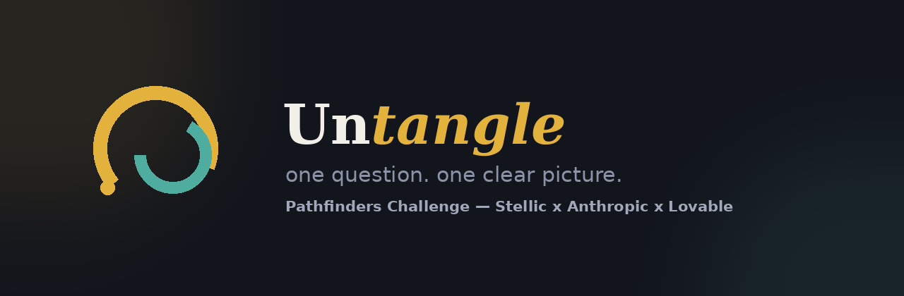

<p align="center">
  
</p>

<p align="center">
  
</p>

<h3 align="center">One question. One clear picture.</h3>
<p align="center">Built for the <strong>Pathfinders Challenge</strong> — Stellic x Anthropic x Lovable</p>

---

## What it is

Most college advice tools are chatbots wearing a nicer font — you type a question, you get a paragraph back, you scroll. **Untangle does the opposite.** You ask one real question about school, majors, or what comes after, and instead of a wall of text, Claude decides what *shape* the answer actually needs — a timeline, a decision tree, a for/against scale, or a side-by-side comparison — and builds it live, as an animated visual you can explore, not just read.

## Why this isn't just "ChatGPT with a chart"

| | A chatbot | Untangle |
|---|---|---|
| **Format** | Linear text, you scroll | One shape-matched visual per question |
| **Depth** | You have to ask follow-ups yourself | Tap any node to reveal the reasoning behind it |
| **Direction** | Conversation dead-ends until you type again | Every answer ends with a concrete next step *and* 2-3 tappable follow-up questions |
| **Exploration** | Flat | Tap a node to **zoom in** -- Claude generates a new, more focused visual just for that branch, with a breadcrumb trail back up |
| **Memory** | Stateless per message (unless you re-explain yourself) | Session memory carries context across every question, follow-up, and drill-down |
| **Input** | Text only | Text, voice, or **upload a photo of your course list / degree plan** and get a sequencing plan back |
| **Tone** | One fixed voice | Pick how it talks to you -- blunt older sibling, career counselor, or data-driven analyst -- same question, genuinely different reasoning |
| **Judgment** | Treats every question the same | Flags how much a decision actually matters (low / medium / high stakes) |

## How it maps to the five judging criteria

- **Solves a real student problem** -- decision paralysis isn't an information problem, it's a *clarity* problem. Students don't need more advice, they need a way to actually see it. The course-list upload feature in particular targets a concrete, universal pain point: figuring out prerequisite sequencing from a confusing requirements sheet.
- **Originality** -- the shape-matching concept (Claude choosing timeline/tree/scale/comparison per question) and the drill-down exploration model don't exist in any advising tool we're aware of.
- **Scale potential** -- the core mechanism is subject-agnostic. It works for any student, at any school, on day one, with zero setup data required.
- **Design & experience** -- a fully animated, branded experience from boot screen to result: typewriter intro, drawn-in iconography, tap-to-expand nodes, breadcrumb navigation, offline-aware states.
- **How well it's built** -- a real React + TypeScript codebase (not a single-file prototype), a secure serverless proxy so the API key never touches the browser, a PWA with real offline support, and defensive error handling throughout.

## Features

- Shape-matched visuals -- timeline, tree, scale, or comparison, chosen per question
- Tap-to-expand reasoning -- every node has a "why" layer underneath
- "Do this next" -- one concrete action, not vague advice
- Follow-up questions -- tap to keep exploring instead of hitting a dead end
- Drill-down -- zoom into any node for a focused sub-visual, with breadcrumb navigation
- Session memory -- context carries across the whole session
- Persona picker -- sibling / counselor / analyst tone, same question
- Stakes badge -- low/medium/high, so the app signals judgment, not just information
- Voice input -- speak your question
- Read aloud -- accessibility-first, via the browser's built-in speech synthesis
- Image upload -- photograph your course list or degree plan, get a sequencing plan back
- Shareable result cards -- export any answer as a branded PNG
- Offline-capable PWA -- installable, and previously-asked questions stay viewable with no connection
- Quick onboarding -- two taps (year + focus) personalize every answer from question one

## Tech stack

- **React 18 + TypeScript** -- frontend
- **Vite** -- build tool / dev server
- **Claude (Sonnet) via the Anthropic API** -- classifies each question, generates structured content, and reads uploaded images
- **Vercel Serverless Functions** -- backend proxy; the API key never reaches the browser
- **vite-plugin-pwa (Workbox)** -- installable app shell + offline caching
- **html-to-image** -- shareable PNG export
- **Web Speech API** -- voice input + read-aloud (native browser APIs, no extra service)
- **lucide-react** -- icons

## Project structure

```
untangle-app/
├── api/
│   └── ask.ts              # Serverless function -- the only place the API key lives
├── src/
│   ├── components/
│   │   ├── BrandMark.tsx     # The icon, as animatable SVG
│   │   ├── Loader.tsx         # Boot screen + per-question loader
│   │   ├── Visuals.tsx         # Timeline / Tree / Scale / Comparison + next-step + follow-ups
│   │   ├── Extras.tsx           # Persona picker, stakes badge, image attachment chip
│   │   ├── Onboarding.tsx        # First-visit profile capture
│   │   └── ShareCard.tsx          # Offscreen card rendered to PNG
│   ├── App.tsx               # Orchestrator -- state, drill-down stack, session memory
│   ├── App.css                # All styles
│   ├── api.ts                   # Frontend client -- calls /api/ask, never the API key directly
│   ├── hooks.ts                  # Typewriter, voice input, read-aloud, history, profile persistence
│   └── types.ts                   # Shared types + the system prompt
├── public/                    # Icons, manifest assets, README banner
└── vercel.json
```

## Setup

You'll need [Node.js](https://nodejs.org) 18+ and the [Vercel CLI](https://vercel.com/docs/cli).

```bash
# 1. Install dependencies
npm install

# 2. Add your Anthropic API key
cp .env.example .env
# open .env and paste a real key -- get one at https://console.anthropic.com/settings/keys

# 3. Install the Vercel CLI (one-time)
npm install -g vercel

# 4. Run locally -- serves both the frontend AND the /api routes
vercel dev
```

> **Why `vercel dev` and not `npm run dev`?** The AI logic lives in `api/ask.ts`, a serverless function. Plain Vite (`npm run dev`) only serves the frontend and can't reach `/api/ask` -- that will produce a 500 error. Always use `vercel dev` locally.

## Deploying

```bash
vercel                                    # first deploy -> gives you a live URL
vercel env add ANTHROPIC_API_KEY          # paste your key, all environments
vercel --prod                             # redeploy with the key active
```

If your project has **Vercel Deployment Protection** enabled, disable it for Production under Settings -> Deployment Protection, or the manifest/API routes may fail with CORS errors on the preview-style URL.

## Security note

The Anthropic API key lives **only** in `api/ask.ts`, on the server, read from an environment variable. The browser never sees it -- the frontend only ever talks to your own `/api/ask` endpoint. Never commit a real key to this repo or paste one into a chat/issue/PR.

## License

Built for the Pathfinders Challenge. Not currently licensed for reuse.
